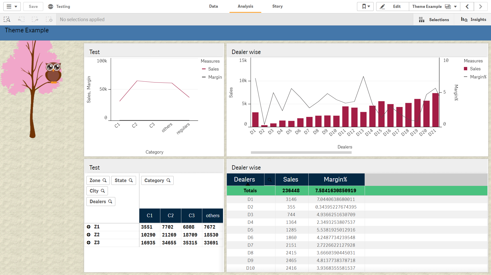

# Qlik-Sense-Styler-Mashup
  ## Basic Styling option for Theming API.
  ### Styling options for
    -Table
    -Pivot
    -Object
<a href="https://sensetheme.com/edit">sensetheme.com for JSON file</a>

<iframe width="560" height="315" src="https://www.youtube.com/embed/2E72RVc5nuI" frameborder="0" allow="accelerometer; autoplay; encrypted-media; gyroscope; picture-in-picture" allowfullscreen></iframe>

